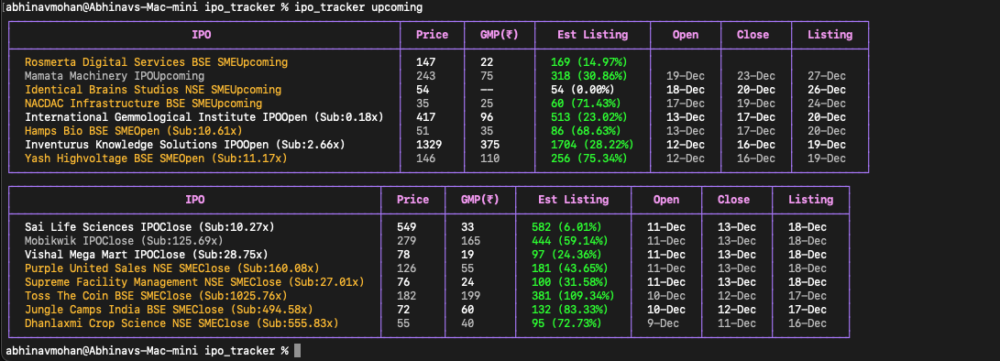
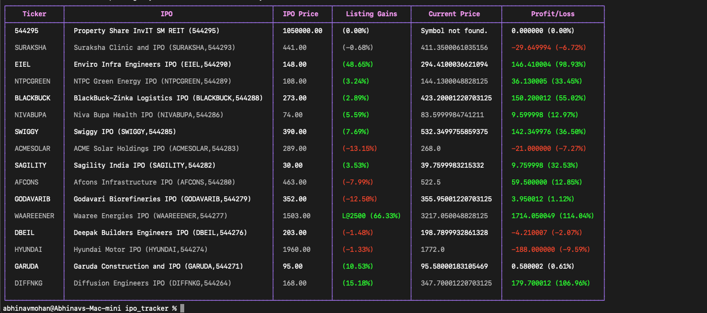
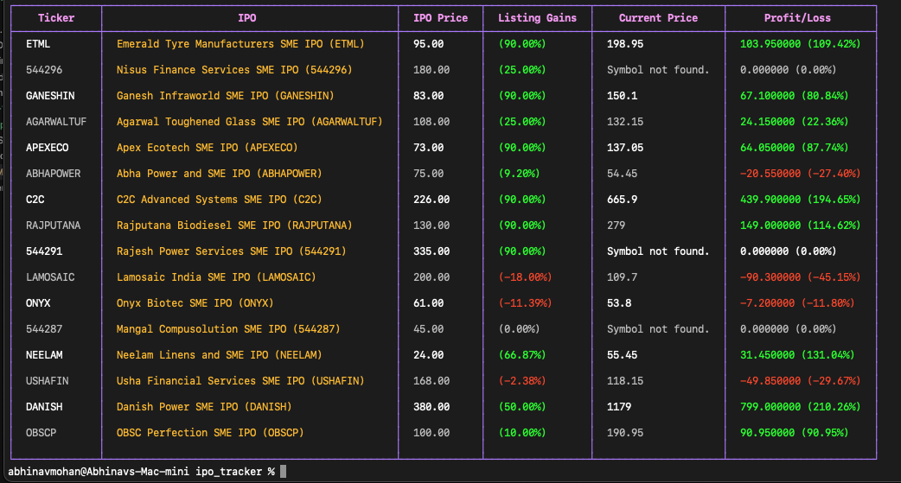

# IPO Tracker CLI

IPO Tracker CLI is a command-line tool designed to fetch and display IPO-related data, including upcoming IPOs, current GMPs, and historical performance. The project uses Python scripts for data fetching and a Go-based CLI for interaction.

## Features
- Fetch upcoming IPO data
- Track performance of recently listed Mainboard IPOs
- Track performance of recently listed SME IPOs

## Prerequisites
1. Install [Go](https://go.dev/doc/install).
2. Install Python (3.9 or later).
3. Set up a Python virtual environment with required dependencies.

## Installation and Setup

### 1. Clone the Repository
```bash
git clone https://github.com/your-repo/ipo_tracker.git
cd ipo_tracker
```
#### Note: You will have to modify all the paths so that they work on your system
### 2. Python Virtual Environment
Create and activate a Python virtual environment:
```bash
python3 -m venv myenv
source myenv/bin/activate
```

Install required Python packages:
```bash
pip install -r requirements.txt
```

### 3. Build the Go CLI
Build the Go-based CLI:
```bash
go install
```

### 4. Add Go Binary to PATH
Ensure the Go binary directory is in your PATH:
```bash
export PATH=$PATH:$HOME/go/bin
```

### 5. Run the CLI
Use the following commands to interact with the CLI:
- **Fetch Upcoming IPOs**:
  ```bash
  ipo_tracker upcoming
  ```
  
- **Fetch Main GMP Data**:
  ```bash
  ipo_tracker main
  ```
  
- **Fetch SME GMP Data**:
  ```bash
  ipo_tracker sme
  ```
  
## Project Structure
```
ipo_tracker/
├── cmd/                     # CLI commands
├── ipos/                    # Python scripts for data fetching
│   ├── price_fetcher.py     # Fetch stock prices using yfinance
│   ├── sme_fetcher.py       # Fetch SME data
│   ├── ipo_tracker.go       # Ipo Tracking functions
├── main.go                  # Entry point for the Go CLI
├── README.md                # Project documentation
├── requirements.txt         # Python dependencies
└── go.mod                   # Go module dependencies
```

## Troubleshooting
- If you encounter Python-related issues:
  - Ensure the virtual environment is activated.
  - Verify the `price_fetcher.py` script works standalone:
    ```bash
    source myenv/bin/activate
    python3 ipos/price_fetcher.py INFY
    ```
- If the CLI isn't recognized:
  - Confirm the Go binary path is added to the `PATH` environment variable.

## Author
Abhinav Mohan  

Email: abhinavmohan12@gmail.com

## License
MIT License
